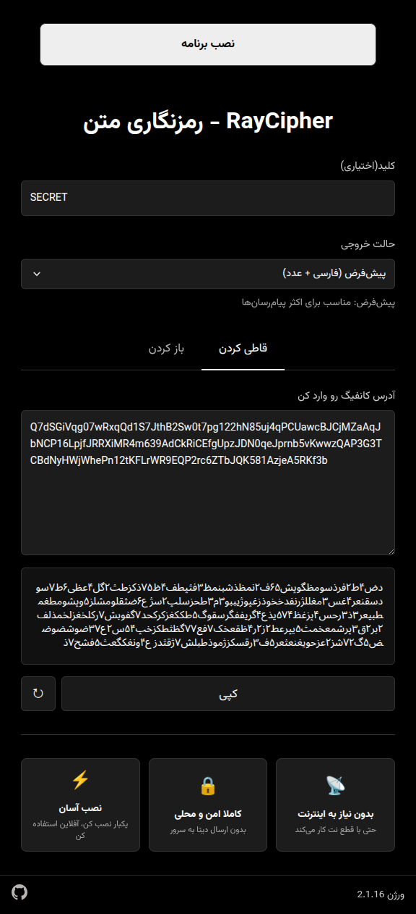

# ری‌سیفر 🔐 RayCipher

ری‌سیفر یک ابزار ساده و تحت وب برای فشرده‌سازی و رمزگذاری متن است. این ابزار برای Encode و Decode کانفیگ‌های شبکه مثل V2Ray و WireGuard طراحی شده و خروجی را به‌صورت کاملاً فارسی تولید می‌کند تا برای ارسال از طریق پیامک یا پیام‌رسان‌ها مناسب باشد.

### [https://mrmoein.github.io/RayCipher](https://mrmoein.github.io/RayCipher)

## تصویر 🖼

## امکانات اصلی ✨

🔑 کلید اختیاری برای رمزگذاری (Password)
در صورت وارد کردن کلید، متن رمزگذاری می‌شود
در صورت خالی بودن کلید، فقط فشرده‌سازی انجام می‌شود

🗜️ فشرده‌سازی خودکار برای کوتاه شدن متن

🔡 خروجی کاملاً فارسی بدون حروف انگلیسی

🔁 باز کردن دقیق متن اصلی (Decode)

📱 قابل نصب به‌صورت برنامه (PWA)

تمام پردازش‌ها فقط روی دستگاه شما انجام می‌شود

## نحوه استفاده 🧭

#### برای قاطی کردن متن
متن را وارد کنید
در صورت نیاز کلید را وارد کنید
خروجی تولید شده را کپی کنید

#### برای باز کردن متن
متن قاطی شده را وارد کنید
در صورت وجود همان کلید را وارد کنید
متن اصلی نمایش داده می‌شود

## نحوه اجرا 🚀

برای استفاده سریع و بدون نیاز به نصب، از نسخه آنلاین RayCipher استفاده کنید

[https://mrmoein.github.io/RayCipher](https://mrmoein.github.io/RayCipher)

یا

پروژه را فورک کنید و از نسخه خودتان استفاده کنید

## نکته امنیتی ⚠️

این ابزار برای جلوگیری از مشاهده ساده و ناخواسته متن طراحی شده است و جایگزین راهکارهای امنیتی پیشرفته نیست

---

Forked from : [MahdiMajdian/v2ray](https://github.com/MahdiMajdian/v2ray)